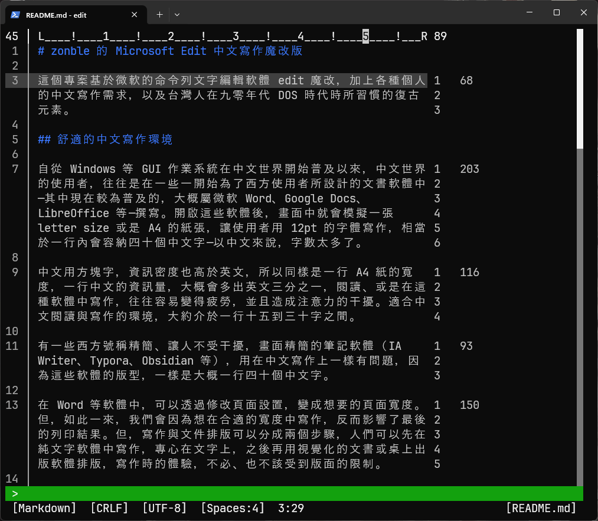

# zonble 的 Microsoft Edit 中文寫作魔改版

這個專案基於微軟的命令列文字編輯軟體 edit 魔改，加上各種個人的中文寫作需求，以及台灣人在九零年代 DOS 時代時所習慣的復古元素。

## 舒適的中文寫作環境

自從 Windows 等 GUI 作業系統在中文世界開始普及以來，中文世界的使用者，往往是在一些一開始為了西方使用者所設計的文書軟體中—其中現在較為普及的，大概屬微軟 Word、Google Docs、LibreOffice 等—撰寫。開啟這些軟體後，畫面中就會模擬一張 letter size 或是 A4 的紙張，讓使用者用 12pt 的字體寫作，相當於一行內會容納四十個中文字—以中文來說，字數太多了。

中文用方塊字，資訊密度也高於英文，所以同樣是一行 A4 紙的寬度，一行中文的資訊量，大概會多出英文三分之一，閱讀、或是在這種軟體中寫作，往往容易變得疲勞，並且造成注意力的干擾。適合中文閱讀與寫作的環境，大約介於一行十五到三十字之間。

有一些西方號稱精簡、讓人不受干擾，畫面精簡的筆記軟體（IA Writer、Typora、Obsidian 等），用在中文寫作上一樣有問題，因為這些軟體的版型，一樣是大概一行四十個中文字。

在 Word 等軟體中，可以透過修改頁面設置，變成想要的頁面寬度。但，如此一來，我們會因為想在合適的寬度中寫作，反而影響了最後的列印結果。但，寫作與文件排版可以分成兩個步驟，人們可以先在純文字軟體中寫作，專心在文字上，之後再用視覺化的文書或桌上出版軟體排版，寫作時的體驗，不必、也不該受到版面的限制。

甚至，現在大部分的文字，並不是出現在紙張上，而是出現在各種大大小小螢幕中，可能在手機螢幕、或是三十吋螢幕上，在寫作時卻受限於 A4 大小、一行四十字的版面，更顯得沒有道理。

說得誇張一點，我們的中文寫作體驗，可說被西方式的版型、還有排版先於寫作的軟體設計所綁架。一套可以調整換行寬度的純文字編輯器，或許是更好的寫作工具。

## 純文字的寫作工具

我們可以在 VIM 或是 Emacs 等純文字編輯軟體中，像是透過 Emacs 中的 visual-fill-column 套件，修改換行（soft-wrap）寬度。

不過，個人往往也會用這些編輯器，編輯其他種類的文字檔案，不見得都用於中文寫作，要切換到適合中文寫作的環境，往往需要來回切換，有些麻煩，而個人還有一些既有編輯器不能滿足的需求，直接有一套針對中文寫作需求的文字編輯器，也是一個可以考慮的選擇。

微軟最近幾年重新開發的 edit ，是一套輕巧但是優異的軟體。他的定位是讓用戶可以在命令列中，快速編輯一些設定檔，並不打算做一套可以編輯各種程式的全能編輯器—這對中文寫作已經非常夠用。微軟使用現代化的 Rust 語言與相關工具開發 edit，在 Windows、macOS、Linux 等平台上都可以直接編譯，在個平台上都可以使用。微軟 edit 的 Unicode 支援比起一些編輯器也更加完整，甚至還做了中文避頭點功能。

## 魔改

在微軟 edit 的基礎上，本專案加上了以下功能：

- 換行位置：可以用選單，或是命令列上的 set-word-wrap-column 功能，選擇在幾個英文字母的寬度換行。
- 設置換行時，可以選擇是否要在螢幕上顯示 WordStar 風格的標尺（或是 Emacs 的 ruler mode），知道換行位置
- 中文標點：可以使用 `Alt + ,`、`Alt + .` 等快速鍵，輸入中文標點。
- 功能命令化：在原本 edit 編輯器的下方，增加一行命令行，可以用九零年代文書軟體中的方式輸入命令。
- 古老編輯器的快速鍵：像是 F2 存檔、F3 存檔並退出、F4 退出，符合活過九零年代的台灣人的寫作肌肉記憶。
- 配色：採用九零年代台灣的文書軟體流行的配色。像是綠色工具列、以及藍底白字的編輯區等。

## 段落節奏調節器

這個魔改版本有一項過去各種編輯器應該都沒有的功能，就是即時顯示一個段落中有多少字，功能是—提示寫作者某一段是不是已經寫得太長，應該要考慮刪減或是分段。

個人的寫作習慣是，如果要讓文字流暢易讀，一段文字的長度會介於一百字到兩百字之間。整篇文章都是，短句會顯得鬆散，一段文字太長，也會影響閱讀，除非是要刻意創造特殊效果，才會在流暢的段落中打破框架，出現刻意的短句或長段落，創造疲倦感、或是提示可以在某個段落可以停頓閱讀。

每一段的段落長度，會影響閱讀的節奏，這項功能，就是一個協助調整段落節奏的調節器。
